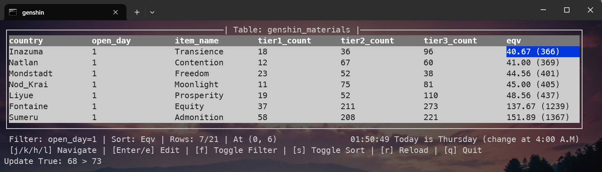
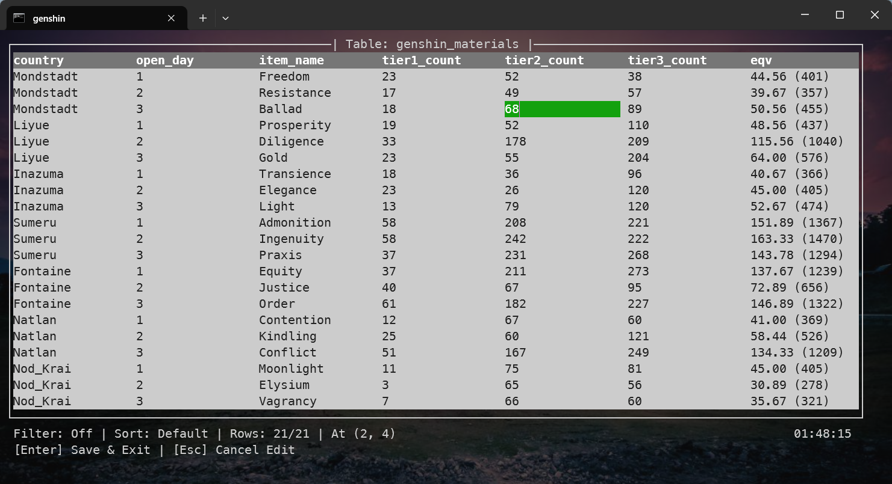
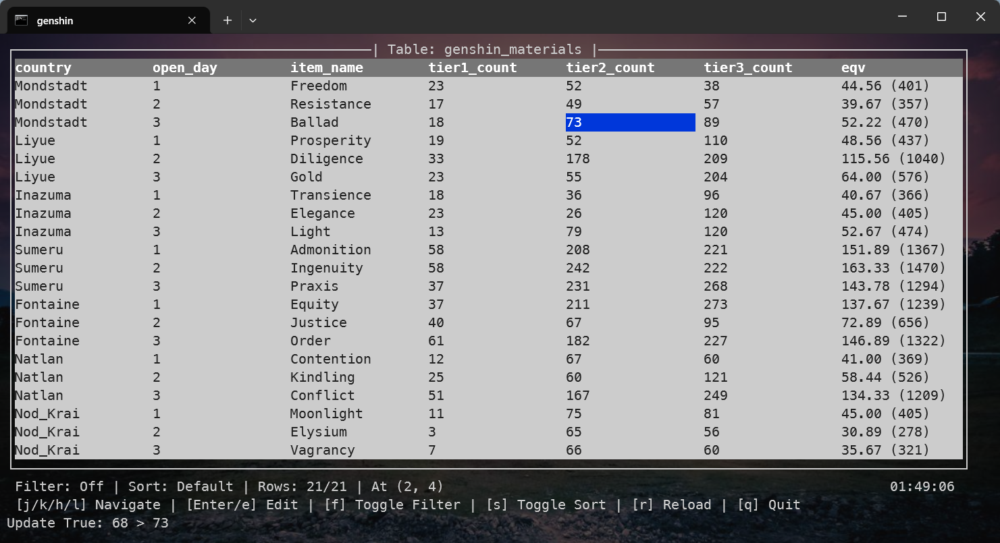

# A Little Item Database

## intro



## run

```bash
# default: genshin_materials
uv run cli.py
uv run cli.py starrail_materials
```

or

```powershell
.\genshin_materials.cmd
.\starrail_materials.cmd
```

## test

```bash
uv run test.py
```

## appendix

### change data




### filter & sort


